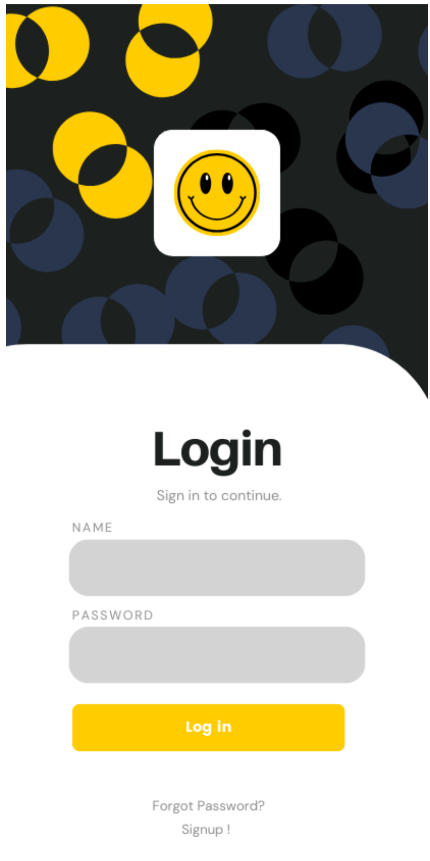
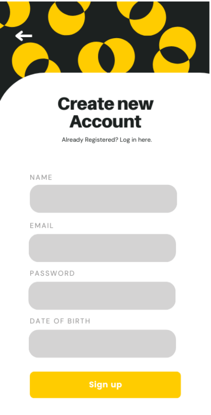

# Critérios de Aceitação

## 1. Como usuário mobile, quero fazer login no aplicativo

Critérios de aceitação:
- O usuário deve poder acessar a tela de login.
- Deve haver campos para inserir o nome de usuário e senha.
- Deve haver o botão de Log In
- Após inserir as credenciais corretas, o usuário deve ser redirecionado para a página inicial do aplicativo.

## 2. Como usuário mobile, quero redefinir minha senha

Critérios de aceitação:
- O usuário deve ter a opção de redefinir sua senha.
- Deve haver um campo para inserir o endereço de e-mail associado à conta.
- Após enviar o pedido de redefinição de senha, o usuário deve receber um e-mail com as instruções necessárias.

## 3. Como usuário mobile, quero criar uma nova conta

Critérios de aceitação:
- O usuário deve ter a opção de criar uma nova conta.
- Deve haver campos para inserir informações como name, email, password e date of birth.
- Deve haver o botão de Sign up
- Após criar a conta, o usuário deve receber uma confirmação por e-mail.